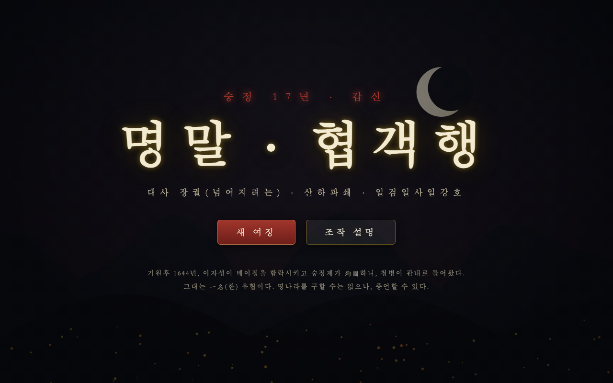
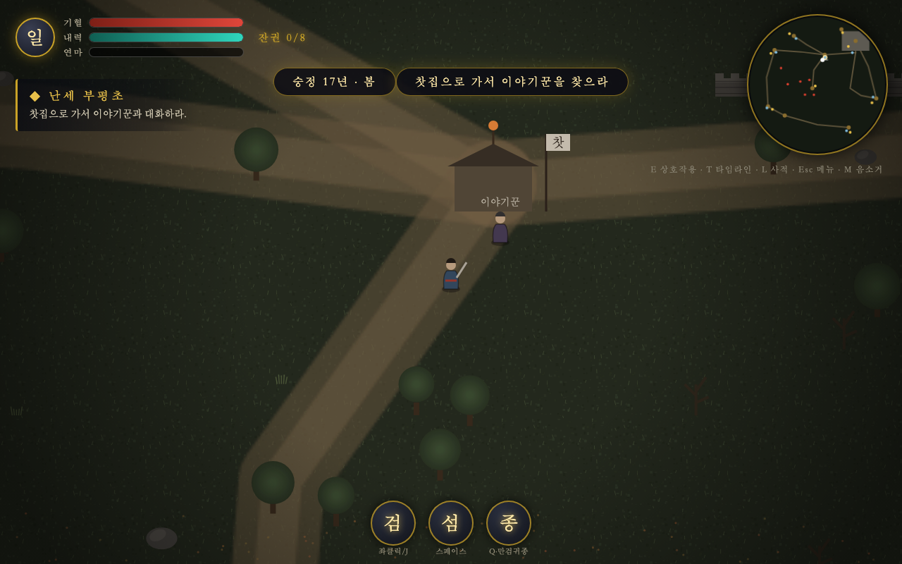
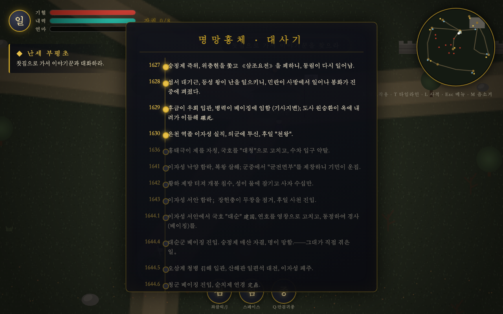
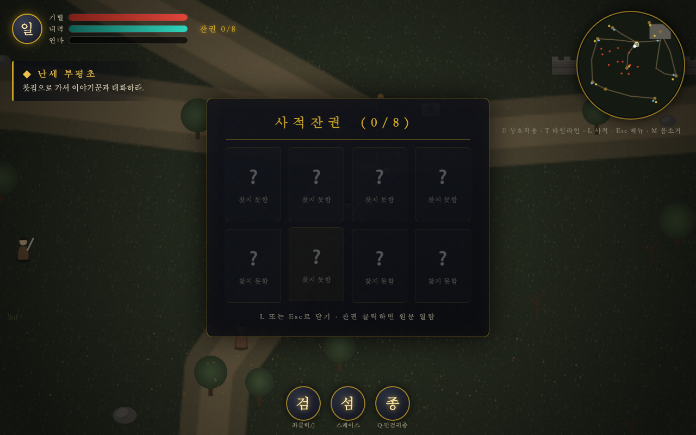

# 명말 · 협객행 —— 갑신 1644 (한국어판)

> 대사장궐(넘어지려는 큰 집이 기울어짐) · 산하파쇄 · 일검일사일강호(한 자루 검이 한 페이지 역사 한 무렵 강호)


-blue?style=flat-square)


명말 갑신지변(**1644년**)을 배경으로 한 **웹 오픈월드 2D 액션 게임**.
그대는 한 명의 유협 — 대명을 구할 수는 없으나, **증언**할 수 있다.

순수 HTML5 Canvas + JavaScript 단일 파일로 구현. **의존성 0, 빌드 0**, 열자마자 플레이.

---

## 🎮 라이브 플레이

**[https://sigco3111.github.io/mingmo-game-korea/](https://sigco3111.github.io/mingmo-game-korea/)**

---

## 📜 원작 저장소 (Attribution)

이 프로젝트는 다음 원작의 한국어화(fork)입니다.

| 항목 | 정보 |
|---|---|
| **원작** | [ShowiBin/MingMo-Game](https://github.com/ShowiBin/MingMo-Game) |
| **원작자** | [ShowiBin](https://github.com/ShowiBin) |
| **원작 라이선스** | MIT (별도 표기 시) / 본 저장소는 원작 표시 + 동일한 비영리 조건 유지 |
| **한국어화 작업** | sigco3111 (한국어 UI/대화/사료/타임라인 전체 번역) |

원작의 모든 게임 로직, 그래픽, 사운드, 월드 디자인은 그대로 유지되었으며,
**UI 문자열, NPC 대화, 임무 설명, 역사 사료 번역, README만 한국어로 변경**되었습니다.

---

## 🕹️ 조작법

| 키 | 기능 |
|---|---|
| `W A S D` | 강호 걸어다님 |
| `마우스 좌클릭` / `J` | 검 휘두르기 (마우스 방향으로 검기 발사) |
| `스페이스` / `K` | 경공 회피 (내력 소모, 잠시 무적) |
| `Q` | 필살기 · 만검귀종 |
| `E` | 대화 / 상호작용 |
| `T` | 명말 대사 타임라인 (1627–1662) |
| `L` | 사적잔권 (천하에 흩어진 실제 사료 8권) |
| `M` | 음소거 |
| `Esc` | 일시정지 / 메뉴 |

---

## 🗺️ 게임 콘텐츠

### 9개 오픈월드 거점

| 거점 | 설명 |
|---|---|
| **찻집** | 이야기꾼이 사는 곳, 게임 시작점 |
| **경사 (베이징)** | 숭정제의 도성 — 천하의 중심 |
| **매산 (석산)** | 만세산의 노회수 — 숭정제 승국처 |
| **류가장** | 평온한 마을, 늙은 난민의 거처 |
| **난민진** | 동란을 피해 도망친 자들의 텐트촌 |
| **대순군영** | 이자성의 군영, "천(쟁)" 자 깃발 |
| **초토촌** | 불타버린 마을, 무덤 9기 |
| **산해관** | 일편석 대전의 현장, 청병 관문 |
| **파효사** | 300년 은행나무가 있는 절 |

도로로 연결되어 있으며, **주야 교체**, **비/눈/재 3종 날씨** 적용.

### 6단계 메인 스토리

1. **난세 부평초** — 찻집의 이야기꾼과 대화
2. **검경지환** — 관도 유구 5명 처치
3. **한 끼의 은혜** — 건량을 난민 부인에게 전달
4. **갑신지변** — 매산에 올라 숭정제 승국 증언
5. **산해관 밖** — 청병 8명 격퇴
6. **청사여진** — 찻집으로 돌아가 이야기꾼에게 마지막 이야기 청취

### 8권 역사 사료 (실제 문헌 인용)

지도 곳곳에 흩어진 8권의 잔권은 모두 **실제 역사 문헌**입니다. 한자 원문 + 한국어 번역 병기.

| # | 제목 | 출전 | 위치 |
|---|---|---|---|
| 0 | 《명사 · 유적전》 | 청조 편찬, 이자성 전기 | 대순군영 |
| 1 | 숭정 유소 (선유소) | 숭정제 매산 자결 시 호적 | 매산 |
| 2 | "천왕 맞이" 민요 | 갑신년 전후 중원 유포 | 난민진 |
| 3 | 《갑신전신록》 | 갑신년 3월 19일 기록 | 경사 |
| 4 | 사가법 《복다르곤서》 | 남명 사가법, 청 다르곤에게 보낸 편지 | 파효사 |
| 5 | 《양주십일기》 | 을유 양주 성함 기록 | 초토촌 |
| 6 | 오삼계 《기서서》 | 오삼계, 청에 군세 요청 | 산해관 |
| 7 | 담천 《국작》 | 명조 실록, 56년 저술의 산증인 | 류가장 |

### 7명 NPC (역사적 인물 기반)

- **이야기꾼** — 찻집에서 강호의 모든 흐름을 설명하는 자
- **늙은 난민** — 섬서 대한을 겪고 살아남은 자
- **난민 부인** — 연안부에서 도망친 가족의 어머니
- **유방승** — 경사 대역(큰역병) 시 시체를 묻던 승려
- **금의위 밀정** — 해산된 창위(명조 자객기관) 출신
- **대순군 노병** — 본래 은천역(은천 우체역) 역졸
- **관녕군 초관** — 오삼계 휘하 산해관 수호자

각 NPC의 대사는 **실제 역사 맥락**(각자의 출신, 시기, 처지)에 맞춰 한국 무협 톤으로 자연스럽게 재구성되었습니다.

### 전투 시스템

- **검기 탄도** + **근접 호광** (마우스 방향 공격)
- **경공 회피** (스페이스, 0.3초 무적 + 파티클)
- **필살기 AOE** (Q, 360도 12방향 만검귀종)
- **4종 적**: 유구 (도적) / 유구 두목 / 청병 예졸 / 청병 궁수
- 경험치 레벨업, 드롭 (건량/물), 화면 진동, 영구 핏자국 레이어

---

## 🎨 UI 디자인

- **수묵화 다크 톤** — 검정 베이스 + 금빛/붉은 인장 강조
- **해서체 금자 헤드라인** — 타이틀 "명말 · 협객행"
- **재 떨림 타이틀** — 화면 흔들림 + 잉크 번짐
- **원형 미니맵** — 9개 거점 도로망 + 적(적색) / NPC(황색) 표시
- **스킬 쿨다운 원** — 검/섬/종 한 글자 + 쿨 표시
- **타임라인 수기** — 1627~1662 역사 사건 잠금/해금 시각화

---

## 🛠️ 기술 스택

| 항목 | 구현 |
|---|---|
| **렌더링** | 순수 Canvas 2D (WebGL 없음) |
| **에셋** | 모두 **프로그래밍 생성** — 외부 이미지/사운드 파일 0 |
| **사운드** | WebAudio API 합성 (oscillator + biquad filter) |
| **월드 생성** | mulberry32 시드 RNG (16440425) |
| **그리기** | Y 정렬 깊이 드로잉, 저해상도 도로/핏자국 영구 레이어 |
| **저장** | localStorage (임무 진행 / 잔권 수집 / 경지 / XP) |
| **빌드** | 없음 (`index.html` 직접 오픈) |
| **의존성** | **0개** |

---

## 🚀 로컬 실행

빌드 필요 없음, 브라우저로 `index.html` 열기만 하면 됩니다.

### 방법 1: 직접 오픈
```bash
open index.html        # macOS
xdg-open index.html    # Linux
```

### 방법 2: 로컬 서버 (권장)
```bash
npx serve .            # Node.js
python3 -m http.server 8000  # Python
```

`http://localhost:8000` 으로 접속.

---

## 📂 파일 구조

```
mingmo-game-korea/
├── index.html      # 메인 HTML (한국어 UI 구조)
├── game.js         # 게임 로직 (73KB, 1633줄 — 주석 포함)
├── style.css       # 수묵화 다크 UI 스타일
└── README.md       # 이 문서
```

| 파일 | 라인 | 설명 |
|---|---|---|
| `index.html` | ~130 | HUD/타이틀/패널/DOM 구조, lang="ko" |
| `game.js` | 1,633 | 게임 전체 로직, NPC 대화, 사료 원문/번역 |
| `style.css` | ~400 | 다크 톤 스타일, 미니맵, 게이지바 |

---

## 🔄 한국어화 변경 내역

원본 → 한국어화에서 **변경된 항목**:

| 영역 | 변경 |
|---|---|
| **메타데이터** | `<html lang="ko">`, `<title>명말 · 협객행 —— 갑신 1644</title>` |
| **타이틀 화면** | "새 여정", "조작 설명", 시대 설명 문구 |
| **HUD** | 기혈/내력/연마, 잔권 카운터, 임무 트래커, 키 힌트 |
| **패널** | 조작 설명, 일시정지, 사망, 결말 패널 |
| **스킬 라벨** | 검/섬/종 + 좌클릭/J · 스페이스 · Q·만검귀종 |
| **NPC 대화 (7명)** | 전 부 한국 무협 톤으로 자연스럽게 재구성 |
| **임무 6개** | 이름 + 설명 한국어 |
| **타임라인 (14건)** | 1627~1662 역사 사건 |
| **사료 (8권)** | 한자 원문 + 한국어 번역 병기 |
| **코드 주석** | 한자 주석 → 한국어 주석 (게임 로직 무변경) |
| **알림/통지** | 레벨업/사망/컷신 한국어 |

**변경되지 않은 항목**:
- 게임 로직 / 렌더링 / 사운드 / 월드 생성 / 저장 로직 100% 동일
- 그래픽(모두 프로그래밍 생성)
- 좌표 / 시간 / 시드값 / 난수 알고리즘

---

## 🤝 기여

원작 코드에 대한 이슈/PR은 [ShowiBin/MingMo-Game](https://github.com/ShowiBin/MingMo-Game) 에 올려주세요.
한국어 번역 품질 관련 피드백은 [sigco3111/mingmo-game-korea](https://github.com/sigco3111/mingmo-game-korea) Issues 에 올려주세요.

---

## 📜 라이선스

원작 [ShowiBin/MingMo-Game](https://github.com/ShowiBin/MingMo-Game) 의 조건을 따릅니다.
원작자의 표시와 동일한 비영리 조건을 유지합니다.

---

## 🖼️ 스크린샷

| 타이틀 화면 | 플레이 (찻집) |
|---|---|
|  |  |

| 타임라인 패널 | 사적잔권 패널 |
|---|---|
|  |  |

---

## 🙏 감사의 말

원작자 [@ShowiBin](https://github.com/ShowiBin) 께 감사드립니다.
순수 Canvas/JS 만으로 이런 깊이 있는 오픈월드를 만들어낸 것은 놀라운 일이며,
그 결과물을 한국어로 감상할 수 있게 되어 기쁩니다.

> *숭정 17년 3월 19일, 임이 매산에서 승하하셨다. 도적이 우리 시체를 마구 분할함을 허하되, 백성 한 사람도 상하게 하지 말라.*
> (숭정 17년 3월 19일, 임이 매산에서 승하하셨다. 도적이 우리 시체를 마구 분할함을 허하되, 백성 한 사람도 상하게 하지 말라.)
